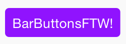

<h3 align="center">
  
</h3>
-------

ADBarButtonFactory
============

### Problem

It's non-trivial to manipulate the "highlighted" background color of the iOS UIBarButtonItem.

### Solution

ADBarButtonFactory.

### How

Programmatically convert a UILabel into an image, and then use this image as the background image for your UIBarButtonItem's highlighted state.
